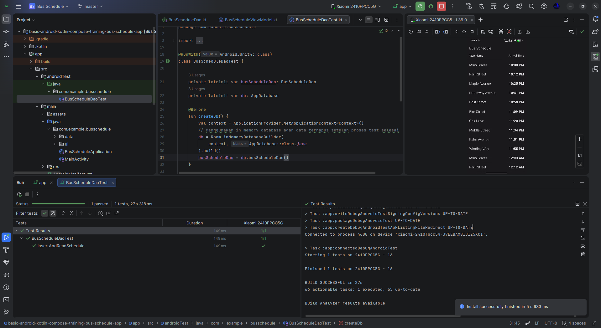
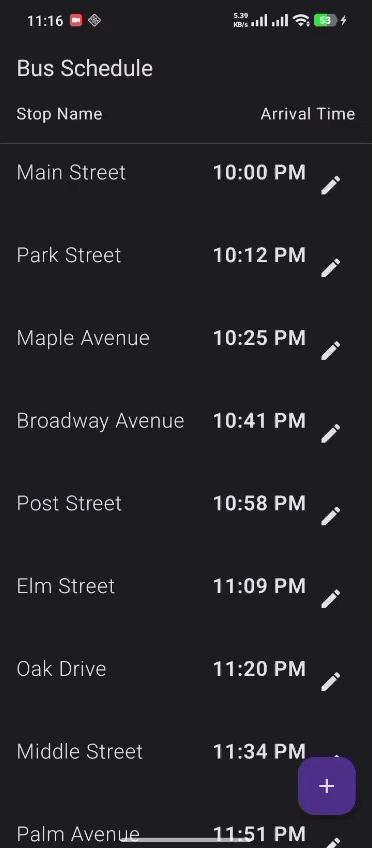

# Bus Schedule App

Aplikasi Android sederhana untuk menampilkan jadwal bus berdasarkan nama halte.
Dibangun menggunakan Kotlin, Jetpack Compose, dan Room Database sebagai tempat
penyimpanan data lokal.

Project ini merupakan pengembangan dari codelab resmi Android Compose dengan
tambahan fitur **CRUD** (Create, Read, Update, Delete) yang memiliki lapisan
*business logic* terpisah dari lapisan UI dan database.

---

## Deskripsi Singkat

Aplikasi menampilkan daftar jadwal bus yang diambil dari database Room.
Pengguna dapat:

- Melihat seluruh jadwal bus pada halaman utama.
- Mengetuk sebuah baris untuk melihat jadwal yang difilter berdasarkan nama halte.
- Menekan lama pada sebuah baris untuk membuka halaman edit.
- Menambahkan jadwal baru melalui tombol **+** di pojok kanan bawah.
- Memperbarui atau menghapus jadwal yang sudah ada.
- Menjalankan *instrumented test* untuk memvalidasi operasi DAO pada database.

---

## Tangkapan Layar

### Tampilan Hasil Test



### Demo Insert Data



---

## Struktur Project

```
app/
├── src/
│   ├── main/
│   │   ├── java/com/example/busschedule/
│   │   │   ├── data/
│   │   │   │   ├── AppDatabase.kt
│   │   │   │   ├── BusSchedule.kt
│   │   │   │   ├── BusScheduleDao.kt
│   │   │   │   └── ScheduleRepository.kt     <- business logic
│   │   │   └── ui/
│   │   │       ├── BusScheduleScreens.kt     <- daftar jadwal + navigasi
│   │   │       ├── BusScheduleViewModel.kt   <- ViewModel + repository
│   │   │       └── ScheduleEditorScreen.kt   <- form Add / Edit / Delete
│   │   └── res/
│   │       └── values/strings.xml
│   └── androidTest/
│       └── java/com/example/busschedule/
│           └── BusScheduleDaoTest.kt         <- instrumented test
└── build.gradle.kts
```

---

## Arsitektur

Alur data mengalir dari lapisan database menuju UI sebagai berikut:

```
Room DAO  -->  ScheduleRepository  -->  BusScheduleViewModel  -->  Compose UI
                (business rules)
```

### 1. Lapisan Data

Berkas `data/BusScheduleDao.kt` berisi query Room:

- `getAll()` - mengambil seluruh jadwal.
- `getByStopName(stopName)` - mengambil jadwal berdasarkan nama halte.
- `getById(id)` - mengambil satu baris untuk halaman edit.
- `getMaxId()` - mengambil nilai id terbesar untuk auto-increment sederhana.
- `insert`, `update`, `delete` - operasi CRUD standar Room.

### 2. Lapisan Business Logic

Berkas `data/ScheduleRepository.kt` memuat aturan bisnis utama:

- **Validasi input**: nama halte tidak boleh kosong, dan `arrivalTimeInMillis`
  harus berada pada rentang `[0, 86.400)` (detik sejak tengah malam).
- **Auto-generate ID** saat insert, agar tidak terjadi konflik primary key.
- **Normalisasi data**: menghapus spasi kosong di awal dan akhir nama halte.
- Hasil validasi dikembalikan sebagai sealed class
  `ScheduleRepository.ValidationResult` sehingga UI bisa menampilkan pesan
  kesalahan per field tanpa duplikasi logika validasi.

Fungsi validasi murni (`ScheduleRepository.validate`) diletakkan pada
`companion object` sehingga dapat dipanggil dari lapisan manapun termasuk
Compose tanpa harus membuat instance repository.

### 3. Lapisan ViewModel

`BusScheduleViewModel` membungkus repository dan menambahkan:

- Penjadwalan coroutine dengan `viewModelScope`.
- Pemetaan hasil validasi menjadi callback `onResult(success)` untuk UI.
- Pengamatan data reaktif menggunakan `Flow`.

### 4. Lapisan UI

- `BusScheduleScreens.kt` menampilkan daftar jadwal dan mengatur navigasi
  menggunakan `NavHost`. Tombol **FAB** (`FloatingActionButton`) digunakan
  untuk menambah jadwal baru, sedangkan tekan lama pada baris membuka
  halaman edit.
- `ScheduleEditorScreen.kt` menampilkan form untuk menambah atau mengubah
  jadwal, lengkap dengan pesan kesalahan per field dan tombol hapus.

---

## Fitur CRUD

| Aksi    | Trigger UI                              | Logika Bisnis                                          |
|---------|-----------------------------------------|--------------------------------------------------------|
| Create  | FAB (+) di halaman utama                | Auto-id, trim nama, validasi field                     |
| Read    | Tap baris di halaman utama              | Filter by stop name, urut berdasarkan arrival time     |
| Update  | Long-press baris, lalu simpan di editor | Validasi ulang, trim nama, simpan perubahan            |
| Delete  | Ikon tempat sampah di halaman edit      | Hapus baris langsung dari DAO                          |

---

## Pengujian

Project ini sudah menyiapkan satu *instrumented test* pada
`app/src/androidTest/java/com/example/busschedule/BusScheduleDaoTest.kt`.

Untuk menjalankan test dari Android Studio:

1. Hubungkan perangkat fisik atau jalankan emulator.
2. Buka berkas `BusScheduleDaoTest.kt`.
3. Klik tanda panah hijau di sebelah deklarasi `class BusScheduleDaoTest`
   lalu pilih **Run 'BusScheduleDaoTest'**.

Atau melalui terminal:

```bash
./gradlew connectedAndroidTest
```

Test ini akan:

- Membuat database Room in-memory.
- Memasukkan satu baris jadwal.
- Membaca kembali data menggunakan `getAll()`.
- Memastikan nilai yang tersimpan sama dengan nilai yang diinput.

---

## Cara Menjalankan Aplikasi

1. Pastikan Android Studio terpasang dan SDK Android 35 sudah tersedia.
2. Clone repository ini lalu buka folder project di Android Studio.
3. Tunggu proses sinkronisasi Gradle selesai.
4. Hubungkan perangkat Android atau emulator.
5. Klik tombol **Run** di Android Studio.

---

## Dependensi Utama

- `androidx.compose.bom` - Bill of Materials untuk Jetpack Compose.
- `androidx.room` - Abstraksi database lokal.
- `androidx.navigation:navigation-compose` - Navigasi antar layar Compose.
- `androidx.lifecycle:lifecycle-runtime-ktx` - `viewModelScope` dan integrasi
  lifecycle.
- `kotlinx.coroutines` - Pemrosesan asynchronous dan `Flow`.
- `androidx.test.ext:junit` dan `androidx.room:room-testing` - Pengujian
  instrumented.

Daftar versi lengkap dapat dilihat pada `gradle/libs.versions.toml` dan
`app/build.gradle.kts`.
